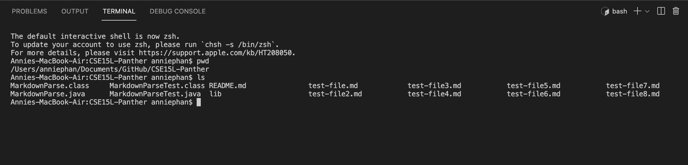
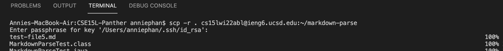
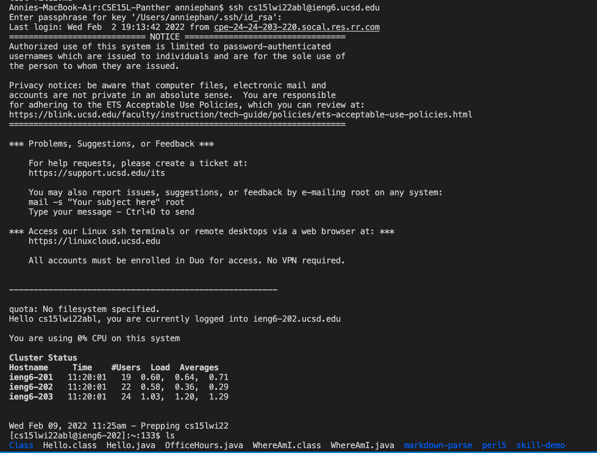

# Lab Report 3
## Copy Whole Directories 
Hello, today I will show how I copy whole directories with `scp -r` and put them into my ieng6 account.

Right now the entire directory is in my client/own computer. Here is a picture of what is in my directory. 

Now I am going to `scp` to copy this directory and put it into my ieng6 account.

In the picture below,
I typed in the command 
`scp -r . cs15lwi22@ieng6.ucsd.edu:~/markdown-parse` with my course-specific initials and logged in. 

Once I called this command, I should now be able to log into the server with `ssh` to my ieng6 account and see this directory called `markdown-parse`. In my account, I typed in `ls` to see all the files in my account and `markdown-parse` is down below. It looks something like this. 

Now, since I have the directory in the server, I am going to compile and run the tests. I first did the command `cd markdown-parse` to change the directory. 

Then to compile and run, I ran these commands:

`javac MarkdownParse.java`
`javac -cp .:lib/junit-4.13.2.jar:lib/hamcrest-core-1.3.jar MarkdownParseTest.java`
`java -cp .:lib/junit-4.13.2.jar:lib/hamcrest-core-1.3.jar org.junit.runner.JUnitCore MarkdownParseTest`
 
Here is what it should look like

The files compiled and ran. The tests passed!

## Using one command line: 
Next, I am going to do this again using one command line.
I am running the `scp` and `ssh` in one line.

