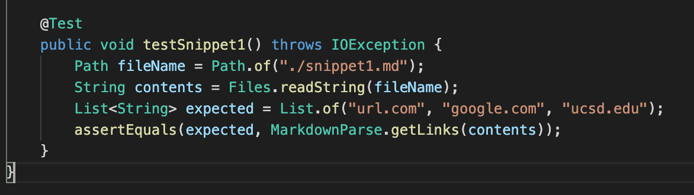
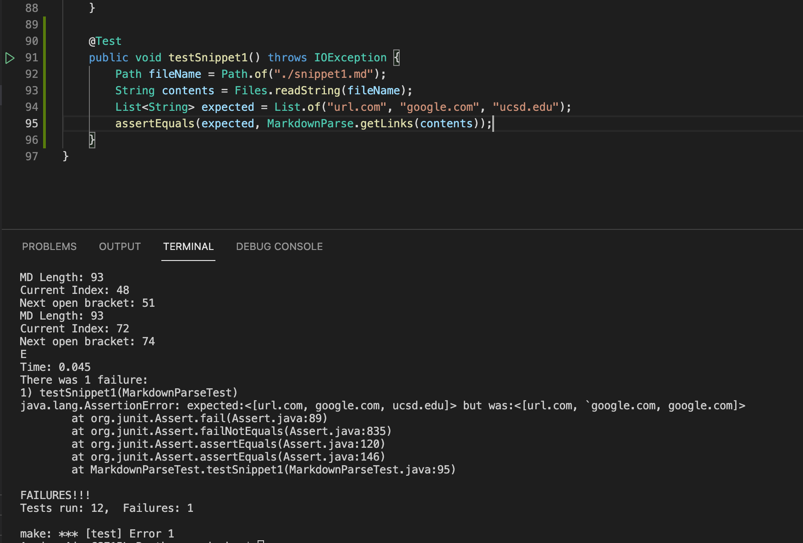
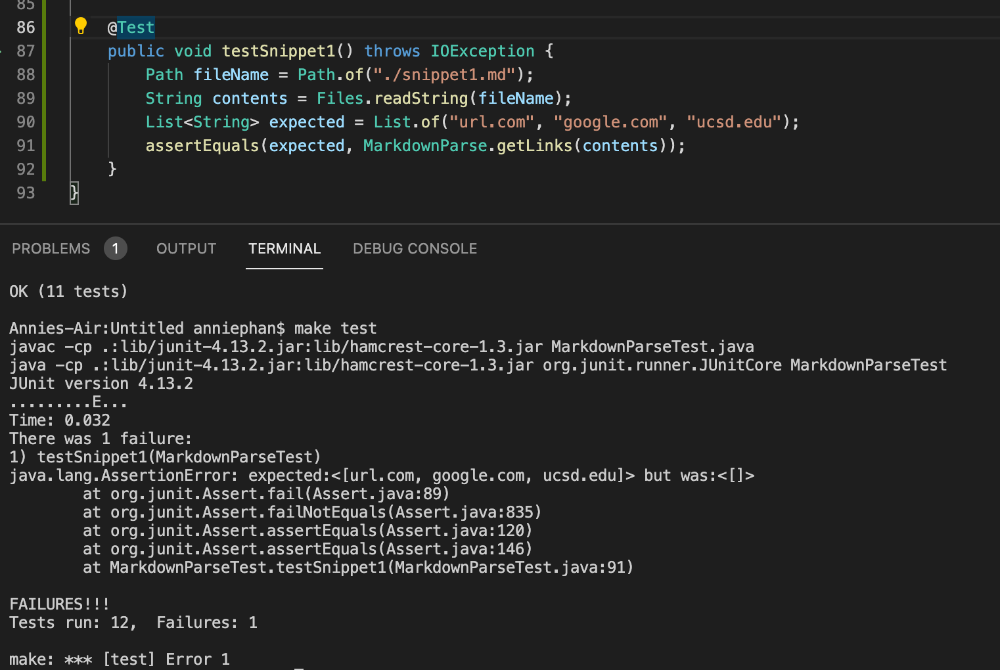
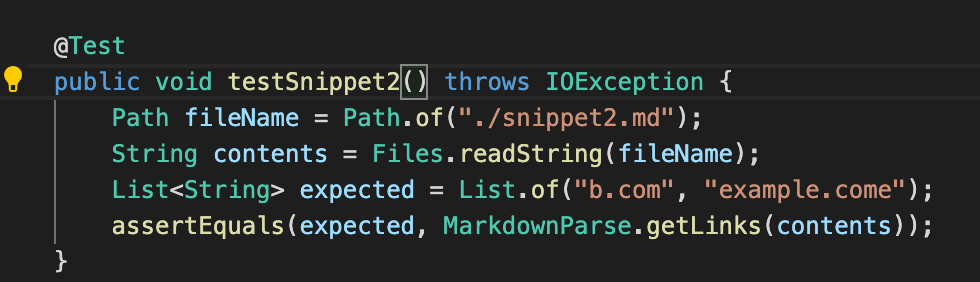
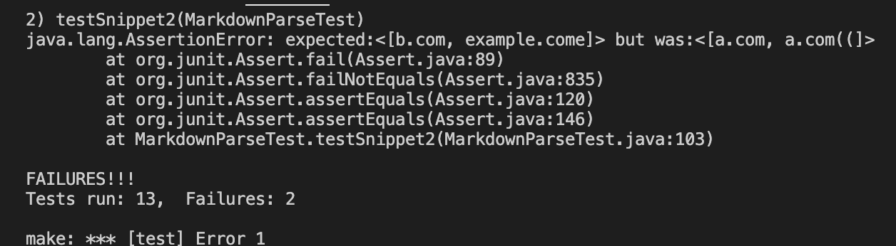
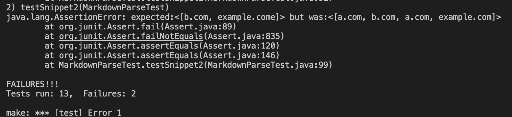
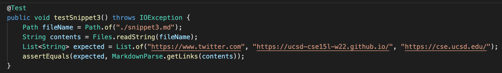
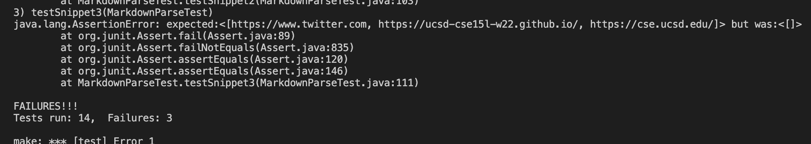
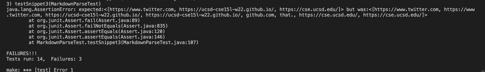

# Lab Report 4
Hello, today I will be making some edits to my group's implementation of `markdown-parse` and another group's `markdown-parse`.

Here are the link to the repos:
- My group [PantherRepo](https://github.com/AnniePhan02/CSE15L-Panther)
- Other group [OtherRepo](https://github.com/ShashankVenkatramani/markdown-parse/)


## Snippet 1
I believe that it should produce `[url.com, google.com, ucsd.edu]`

Here is how I turned it into a test in `MarkdownParseTest.java`


### My group's implementation
Here is the output when running the tests. It did not pass as the expected and actual differed. The JUnit test that failed was on line 95.


### Other group's implementation
Here is the output when running the tests. It did not pass as the expected and actual differed. The JUnit test that failed was on line 91.



## Snippet 2
I believe that it should produce `[b.com, example.come]`

Here is how I turned it into a test in `MarkdownParseTest.java`


### My group's implementation
Here is the output when running the tests. It did not pass as the expected and actual differed. The JUnit test that failed was on line 103.


### Other group's implementation
Here is the output when running the tests. It did not pass as the expected and actual differed. The JUnit test that failed was on line 99.


## Snippet 3
I believe that it should produce `[https://www.twitter.com, https://ucsd-cse15l-w22.github.io/, https://cse.ucsd.edu/]`

Here is how I turned it into a test in `MarkdownParseTest.java`


### My group's implementation
Here is the output when running the tests. It did not pass as the expected and actual differed. The JUnit test that failed was on line 111.


### Other group's implementation
Here is the output when running the tests. It did not pass as the expected and actual differed. The JUnit test that failed was on line 107.


## Additional Questions
1) Do you think there is a small (<10 lines) code change that will make your program work for snippet 1 and all related cases that use inline code with backticks? If yes, describe the code change. If not, describe why it would be a more involved change. 

Yes, I believe that there is a small code change that would make my program work for snippet 1 and all related cases that use inline code with backticks. I want to check if there is a backtick within a closed parentheses because there cannot be a backtick in a link. 

I suggest to search for a backtick and if it exists in the link, the link is not included. To do this, after line 37, I added this code.

```
if (markdown.indexOf("`", nextOpenBracket) >= 0) {
    return toReturn;
}
```

2) Do you think there is a small (<10 lines) code change that will make your program work for snippet 2 and all related cases that nest parentheses, brackets, and escaped brackets? If yes, describe the code change. If not, describe why it would be a more involved change.

No, I feel that there is not a small code change that will make my code work for snippet 2 and all related cases that nest parentheses, brackets and escaped brackets. It would be more of a change that must change the structure of code and how it is formed. I suggest to use a stack and pop type of structure to find the closed and open brackets/parentheses. In order to use this, I would have to restructure my code in the way that it supports a stack structure.

3) Do you think there is a small (<10 lines) code change that will make your program work for snippet 3 and all related cases that have newlines in brackets and parentheses? If yes, describe the code change. If not, describe why it would be a more involved change.

No, there is not a small code change that will make my program work for snippet 3 and all related cases that have newlines in brackets and parentheses. In my current code, it checks for if the link contains spaces and if it does, it does not include the link. Currently, my actual output is `[]` and that is because any link with a space is not added to the data array of links. Therefore, in order to create a fix, I would have to delete my current lines of code that exclude links with spaces and add new code that would consider cases that have newlines in brackets and parentheses.
