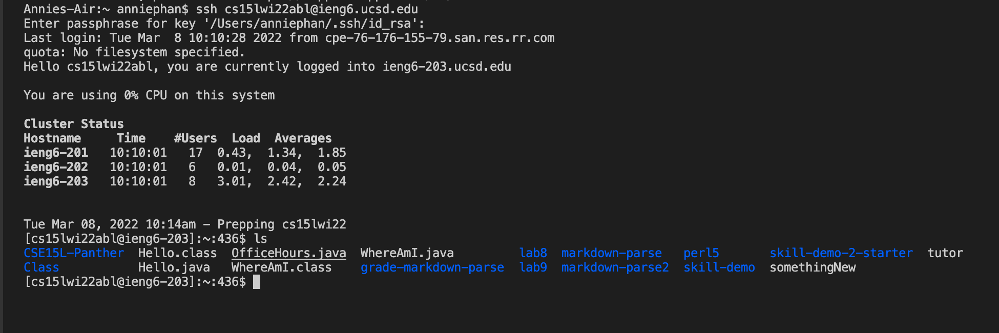
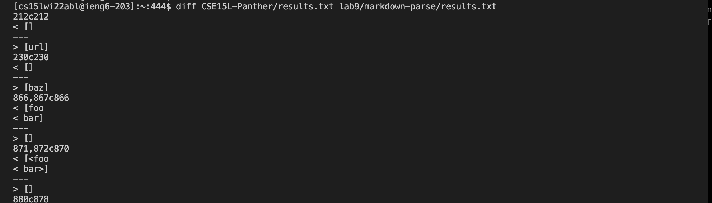
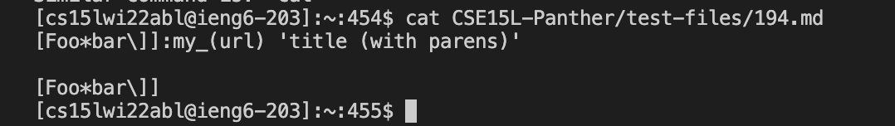
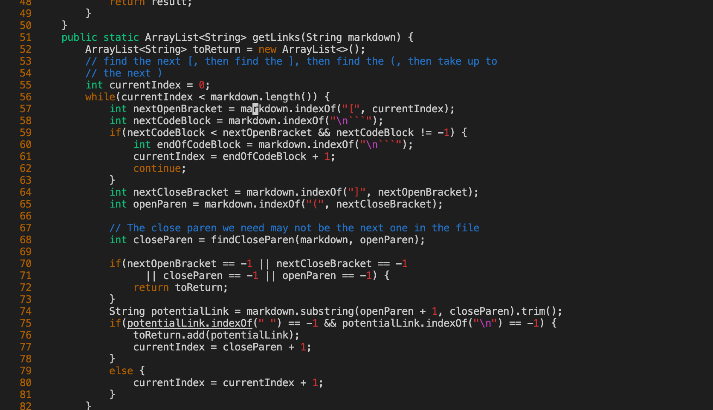
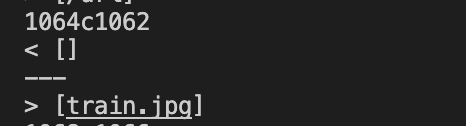
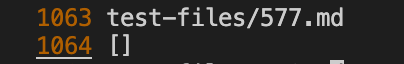
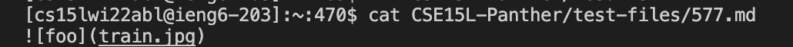
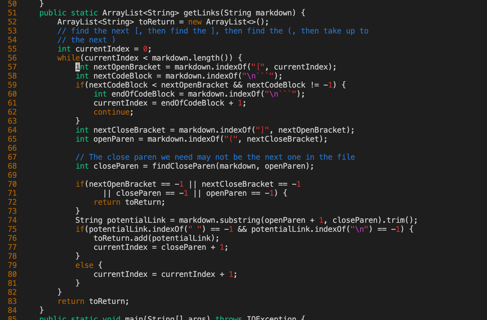

# Lab Report 5
Hello, today I will be going over how I found differences between my implementation and another implementation with many of the 652 tests provided from commonmark-spec.

For this lab, I compared differences between my implementation and the other implementation by using `diff`. Today, I will go through the details of how I found these differences.

For clarification, my implementation is in my `CSE15L-Panther` directory and the other one is in `lab9` on my ieng6 account.

## 1) First Test
I chose test on line 212.

I found this by using the command `diff CSE15L-Panther/results.txt lab9/markdown-parse/results.txt`

As you can see, my implementation has output of `[]` and the other is `[url]`.

So to see what is on line 212 of my implementation, I typed this command `vim CSE15L-Panther/results.txt`

This is what I saw:

This means that on line 212, it had the test output for file `194.md`.

Now looking at the file, I typed in `cat CSE15L-Panther/test-files/194.md` and this is what I saw

This was how I found this test. 

Based on the test file, my implementation is correct because it has an output of `[]` whereas the other implementation has an output of `[url]`. When looking at file `194.md`, there are no valid links so the expected output shoud be no links or in other words, `[]`.

The bug in the other implementation is that it does not consider if there are characters in bewteen the closed bracket `]` and open parenthesis `(`. This is why it considers `url`, which is in the next open and closed parentheses a link. 

The code that should be fixed is in the other implementation as seen below. 

I suggest that around line 65, there should be a check on if the `openParen` is the index right after the `nextCloseBracket` and if so, add consider the code within the link. This is the code that I feel should be fixed.

## 2) Second Test
I chose the test on line 1064 of my implementation. 

I found this by using the command `diff CSE15L-Panther/results.txt lab9/markdown-parse/results.txt`

As you can see, my implementation has output of `[]` and the other is `[train.jpg]`.

So to see what is on line 1064 of my implementation, I typed this command `vim CSE15L-Panther/results.txt`
This is what I saw:

This means that on line 212, it had the test output for file `577.md`.

Now looking at the file, I typed in `cat CSE15L-Panther/test-files/194.md` and this is what I saw.

This was how I found this test. 

Based on the test file, my implementation is correct because it has an output of `[]` whereas the other implementation has an output of `[train.png]`. When looking at file `577.md`, my expected should have no links `[]` which is what my implementation has since the test file is considered an image.

The bug in the other implementation is that it does not consider if the input is an image. It does not consider if there is a `!` in front of the closed brackets, which is why the other implementation considers `train.jpg` to be a link.

The code that should be fixed is in the other implementation as seen below. 

I suggest that around line 70, there should be a check on if the `!` is the index right before the open bracket and if so, skip past this line. Otherwise, there should be a check somewhere within this code to check if the `!` is right before an open bracket `[`.

## Final Words
I hope this made sense. This was a great quarter and I learned a lot. Thank you!
