# Lab 1 Tutorial
Hello, this is how you can remotely log into a course-specific account. I am a MAC user so here are my directions for MAC. 

## 1) Install VSCode on your computer
Click onto the link [VSCodelink](https://code.visualstudio.com/Download) and download the version of VSCode for your computer. I am a mac user so I downloaded the MacOS version.

Once you have installed it on your computer, your screen should look like this:

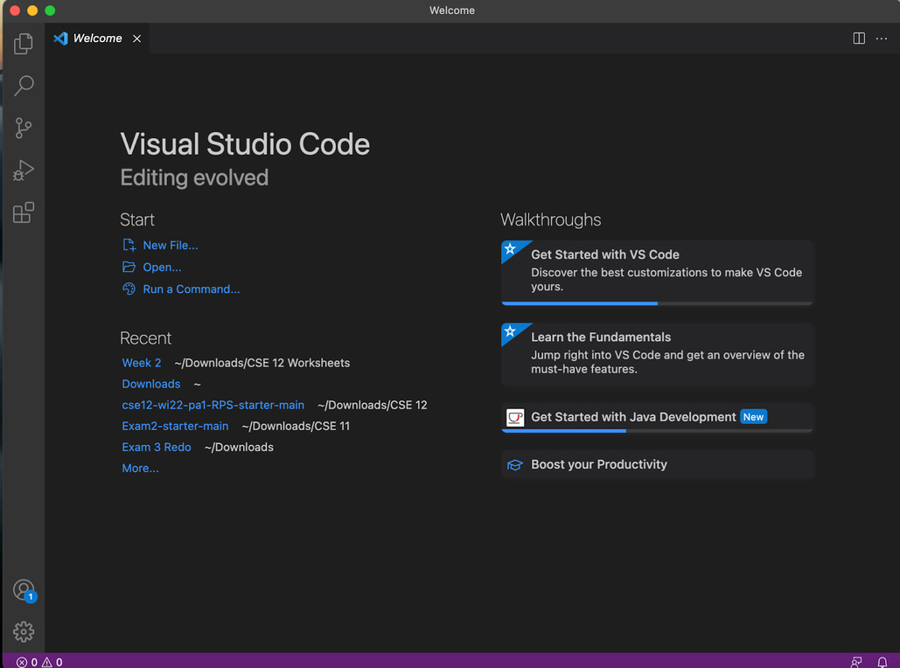


## 2) Remotely connect to your ieng6 course-specific account
Now, let's connect to your course specific account. Locate your account name by following this link: [AccountLookup](https://sdacs.ucsd.edu/~icc/index.php). Note that it will be something along the lines of cs15wi22**zz**@ieng6.ucsd.edu. Replace **zz** with your course-specific initials. 

Also, you will need to change your password in order to activate this account. It might take around 15 minutes for the password to activate before you can remotely log in.

Now, go back to VSCode and pull up the terminal by dragging it up from the bottom of the screen. 

Type in `ssh cs15lwi22zz@ieng6.ucsd.edu` (replace zz with your course-specific account initials)

Since it is likely that it is your first time connecting to this, you will see an output that asks “Are you sure you want to continue connecting?”. Type “yes” and press enter. 

Now, it should ask for your password. Here is what your terminal should look like.

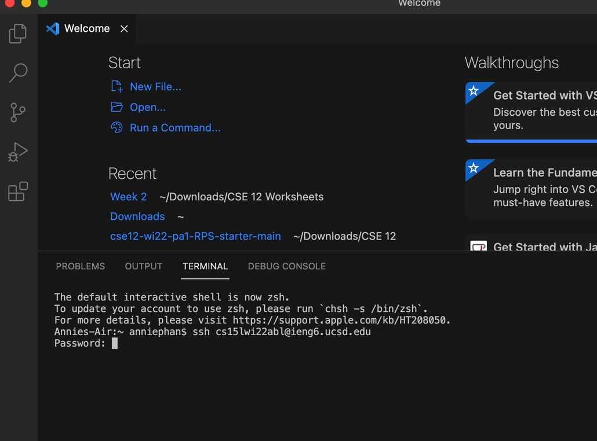

From there, type in your password and press enter. Once you press enter, it should look like this.

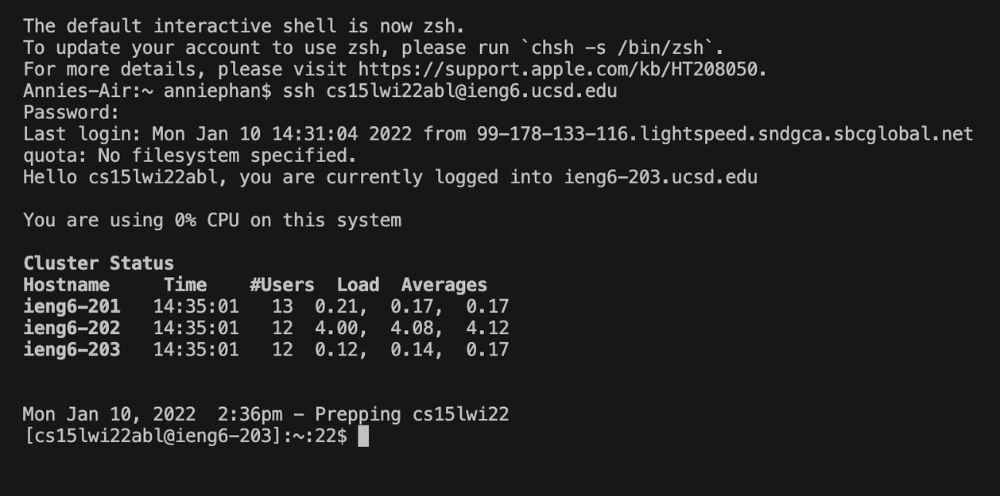


Congratulations! Once you saw that screen in your terminal, it means that you are now successfully connected to the computers in the CSE basement. Time to try some commands!

## 3) Trying some commands
Here are a list of commands that you can do both on your computer(client) and the remote computer (server). There are more that you can try if you know anything else. 
* `cd`
* `ls`
* `pwd`
* `mkdir`
* `cp`

To run both on your computer and the remote computer, on the far right side of the terminal, press “Split Terminal".

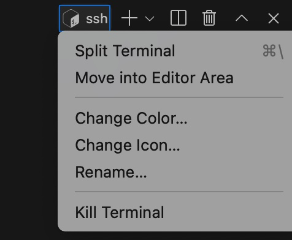

It should look like this after being split. 

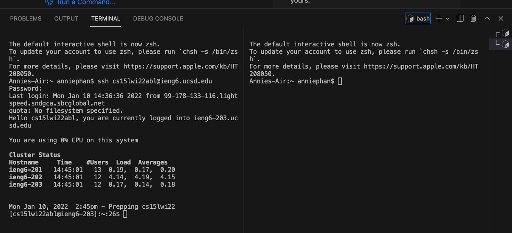

“ssh” is the remote computer (left) and “bash” is your computer(right)

Type in those commands. Compare and contrast what they look like in both your computer and the remote computer. 

Here are my examples of running the `ls` command in the server. 
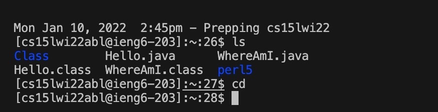

`ls` command in the client.
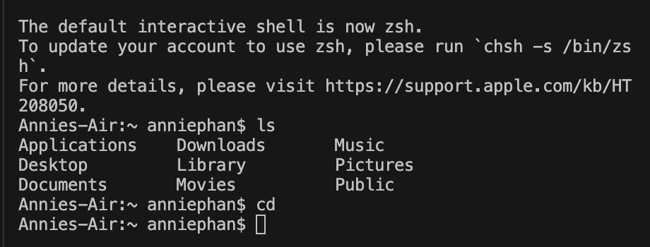

To log out of the remote server, run the command `exit` or use ctrl + D.

## Moving files over with scp
Now, create a file called WhereAmI.java on your computer and insert this into your file. 
```
class WhereAmI {
  public static void main(String[] args) {
    System.out.println(System.getProperty("os.name"));
    System.out.println(System.getProperty("user.name"));
    System.out.println(System.getProperty("user.home"));
    System.out.println(System.getProperty("user.dir"));
  }
}
```

Run WhereAmI.java on your computer using `javac` and `java`. 

From your computer, run this command (replacing **zz** with your course-specific account initials)
 `scp WhereAmI.java cs15lwi22zz@ieng6.ucsd.edu:~`

 Enter your command and enter your password. Your screen should now look like this.
 


Now, log back into your ieng6 remote computer and enter the command `ls`. Now, you should see “WhereAmI.java” listed. It looks something like this. 

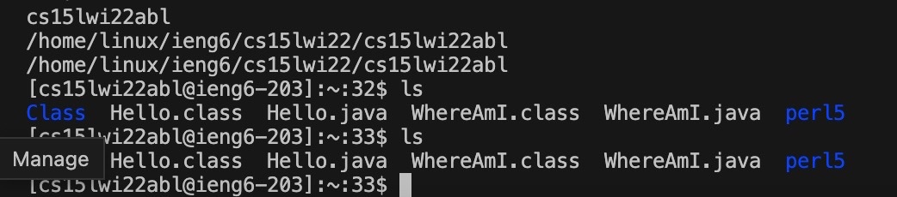

## 5) SSH Keys
On your client/computer, enter the command `ssh-keygen`. 

Follow the screenshot down below to guide you along what to write in your client terminal. Note that mine was asked to overwrite because I already did this step in the past. If it is your first time logging in, then you should be able to go right ahead and enter your own passphrase. 

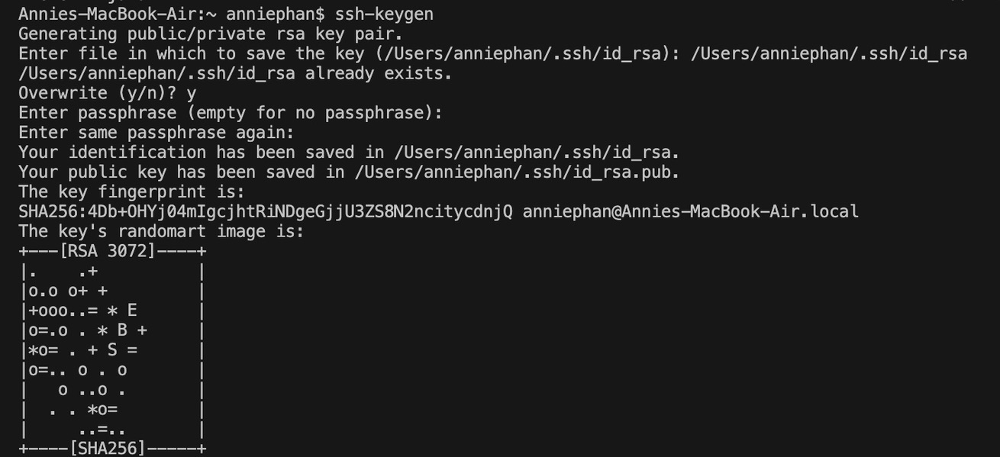

Now that you have made they key, log back into the server. 

Enter `ssh cs15lwi22zz@ieng6.ucsd.edu` and enter your password.

Once on the server, enter the command `mkdir .ssh`.


Now logout from the server. (ctrl + D or `exit`)

Now, go back into your client/your computer. Type this in but replace with your user account and path that you saw in your command. 

`scp /Users/joe/.ssh/id_rsa.pub cs15lwi22@ieng6.ucsd.edu:~/.ssh/authorized_keys`

Now you should be able to do ssh or scp from this client to the server without needing to enter your password. Here is what my screen looks like as a guide.

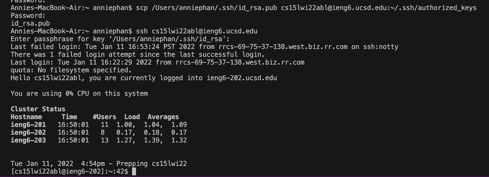

## 6) Optimizing remote running
To optimize your remote running time, some things you can do are:

* At the end of your ssh command, write a command in quotes. This runs the command in the remote server and exit. An example: `ssh cs15lwi22@ieng6.ucsd.edu "ls"`
* Run multiple commands on the same line by separating them by semi-colons. An example: `cp WhereAmI.java OtherMain.java; javac OtherMain.java; java WhereAmI`
* Autocomplete tabs. You can start partially writing in something and press tab for it to fill in the rest if you have already called it before. 
* Toggle between commands. Press with your up and down arrow keys to recall the recent commands. 

For example, here is me running two commands at once in the remote server, and this is what my terminal looks like. 

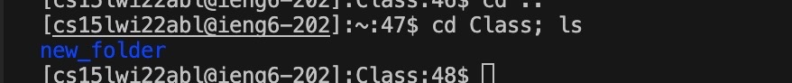

Feel free to spend some time and play around with these commands. 

I hope this tutorial made sense. Have a nice day! Enjoy!