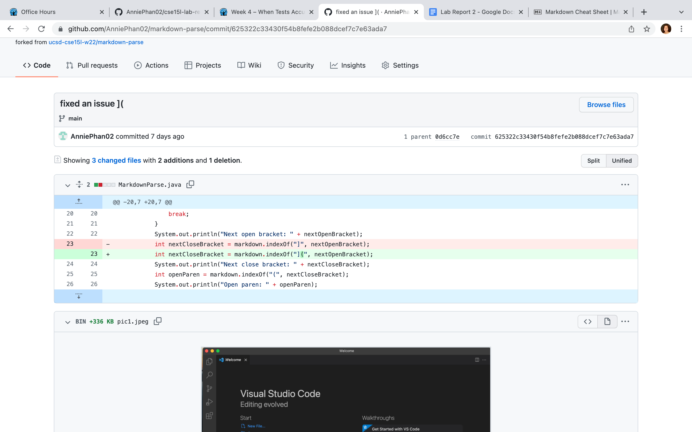
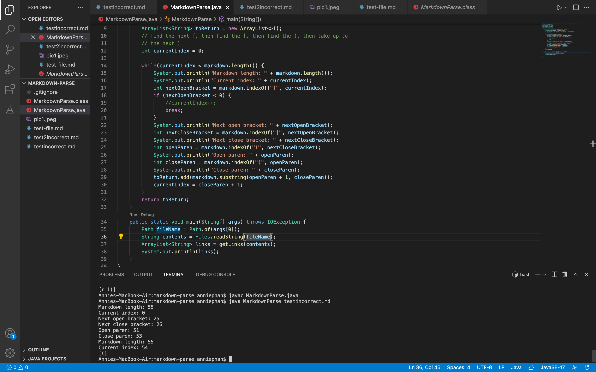
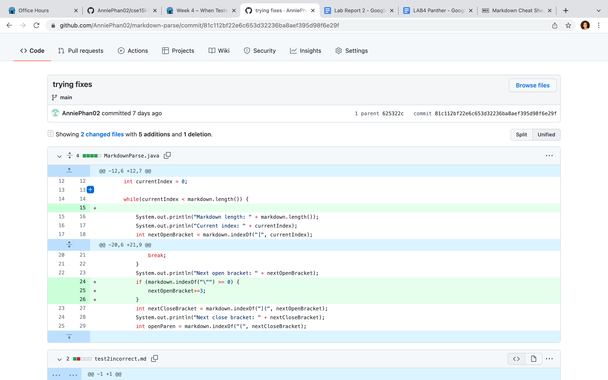
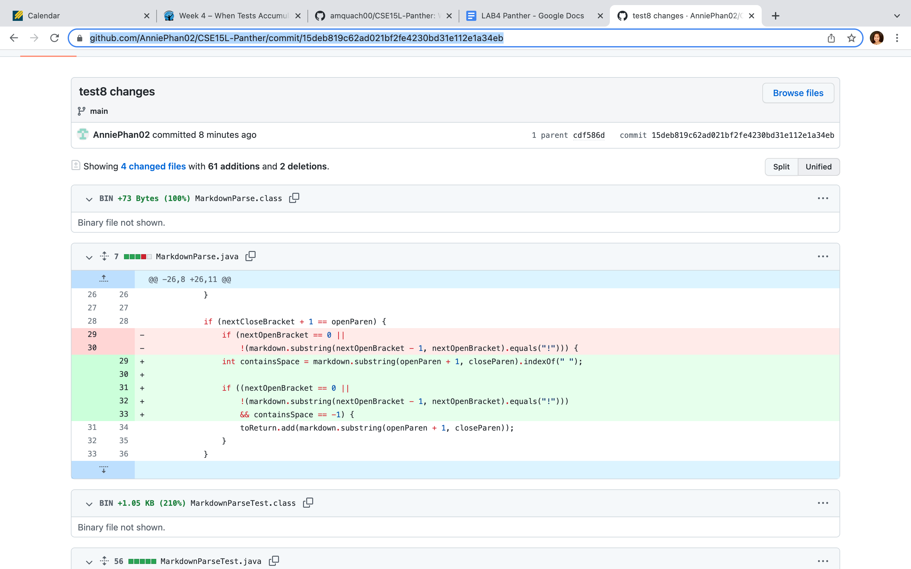
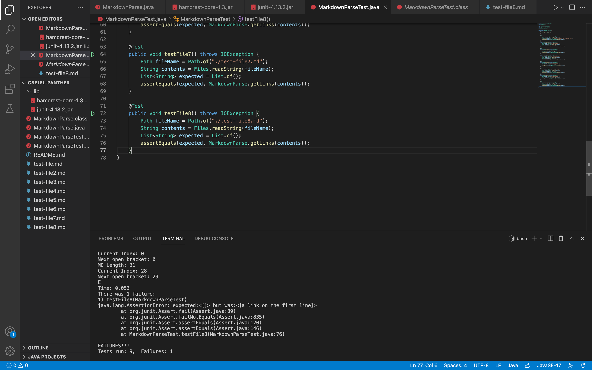

# Lab Report 2
Hello, this lab report covers week 3 and 4. We worked on debugging, symptoms, and failure-inducing inputs. 

Here are the GitHub repos for week 3 and week 4. 

[Week3Repo](https://github.com/AnniePhan02/markdown-parse)

[Week4Repo](https://github.com/AnniePhan02/CSE15L-Panther.git 
)

## 1) First Code Change 
In our code, we found a bug that does not print all of the link needed. It does not take in account if there is something between the last closing bracket and opening parenthesis.

Screenshot history of us fixing this bug: 

Link to test file for failure-inducing input: [testincorrect.md](https://github.com/AnniePhan02/markdown-parse/blob/main/testincorrect.md)

Symptom of the bug was found when running the command line and the expected was different from actual. The expected was `[]` and the actual was `[(]`. Here is the output of running the file at the command line. 

Between the bug, symptom, and failure-inducing input, the disagreement between our expected `[]` and actual value `[(]` showed a symptom. The failure inducing-input in [testincorrect.md](https://github.com/AnniePhan02/markdown-parse/blob/main/testincorrect.md) revealed this symptom of the bug. When retracing code, this was a bug where the indexing was wrong since the program did not account if there was anything in between a closed bracket and open parenthesis. 

## 2) Second Code Change
After changing our code, we found another bug that did not consider if there were parentheses and brackets in the link title.

Screenshot history of us fixing this bug:

Link to test file for failure-inducing input:
[test2incorrect.md](https://github.com/AnniePhan02/markdown-parse/blob/81c112bf22e6c653d32236ba8aef395d98f6e29f/test2incorrect.md)

Symptom of the bug was found when running the command line and the expected was different from actual. The expected was `some-page.html` and the actual was `[r l(]`. Here is the output of running the file at the command line. 

Between the bug, symptom, and failure-inducing input, the expected `some-page.html` and actual `[r l(]` was a symptom. In other words, the failure-inducing input in [file-8.md](https://github.com/AnniePhan02/CSE15L-Panther/blob/main/test-file8.md) showed the symptom of this bug through an unexpected output. When code-tracing, the bug was that the program did not consider if there are parentheses and brackets in the link title. 

## 3) Final Code Change 
We found another bug that considers an input with spaces to be a link. A link cannot have spaces. 

Screenshot history of us fixing this bug: 

Link to test file for failure-inducing input: [file-8.md](https://github.com/AnniePhan02/CSE15L-Panther/blob/main/test-file8.md)

Symptom of the bug was found when running the JUnit test. Here is the output of running the file at the command line. 

Between the bug, symptom, and failure-inducing input, the bug is that the the expected was an empty list which is `[]`, but the actual was `[a list on the first line]`. This failure-inducing input in [file-8.md](https://github.com/AnniePhan02/CSE15L-Panther/blob/main/test-file8.md) has spaces in it which reveals a symptom of this bug. The bug is that the code takes in account the spaces in between the words, which is not right for a link and is revealed through the test failure.

I hope this made sense. Have a nice day! Enjoy!